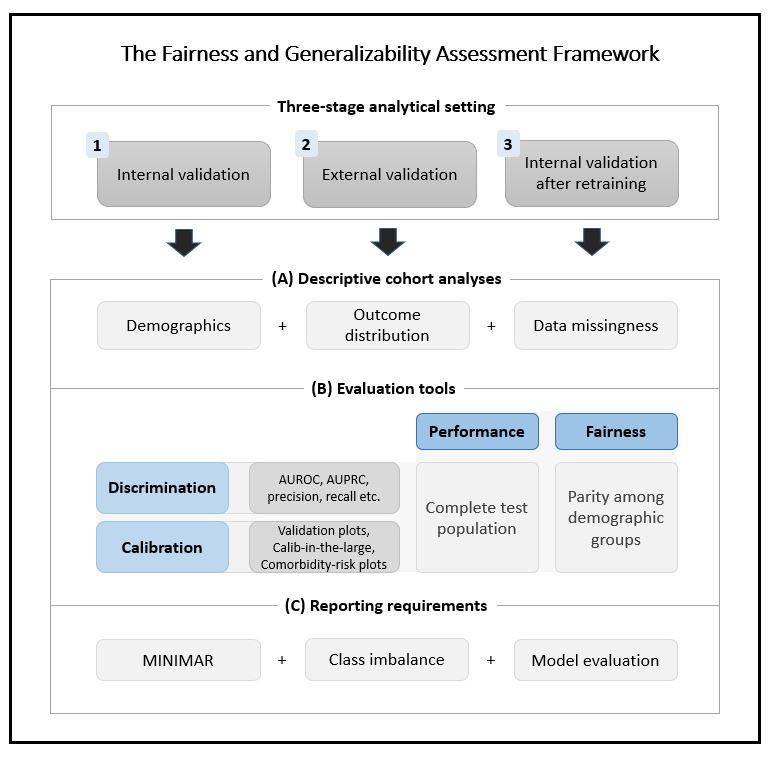

# The Fairness and Generalizability Assessment Framework 

This case study examines the fairness and generalizability of a MIMIC-trained model published in the peer-reviewed article on 
[Multitask learning and benchmarking with clinical time series data](https://www.nature.com/articles/s41597-019-0103-9) by Harutyunyan et al., 
with the source code available [here](https://github.com/YerevaNN/mimic3-benchmarks). The case study is based on the following fairness and generalizability assessment framework:

The source code to create an in-hospital mortality benchmark cohort and train a channel-wise LSTM model on it
has been updated, extended to a new data source (i.e. STARR) and augmented by a comprehensive analysis framework
to examine generalizability and fairness of the risk prediction model.
All code necessary to reconstruct the same analyses can be found in this repository.

This repository contains two main directories:

- `benchmarks`: Pipeline to construct in-hospital mortality (IHM) cohorts
    - *mimic*: Using MIMIC-III v1.4 relational database
    - *starr*: Using STARR_DE relational database
    - Shared scripts
- `models`: Training, testing and evaluation protocols

Detailed usage instructions for how to create benchmark cohorts, use the model
architectures and analyze the output can be found in the README's of the 
corresponding folders and subfolders.

