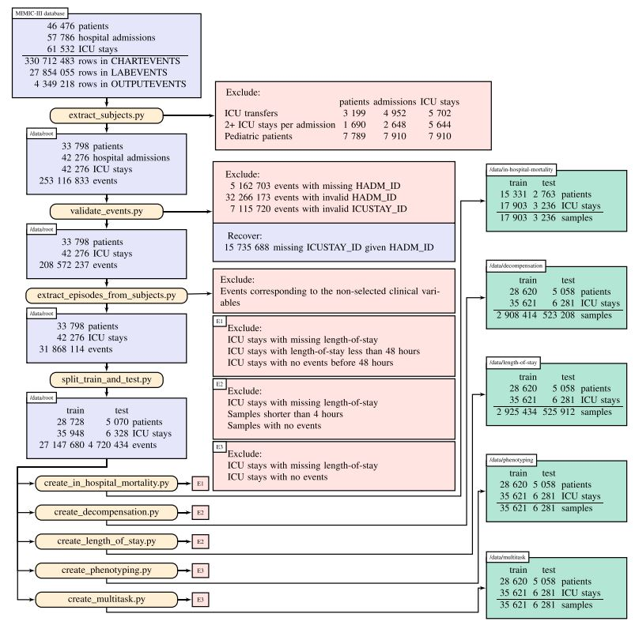

# Benchmark building pipeline

The data preparation pipeline is adapted from Harutyunyan et al.'s article following
their schematics as shown in the figure below. The MIMIC cohort is built directly
with the pre-existing code. For the new STARR cohort, the same criteria have been used
after the variables have been located in the different tables of the STARR2019_DE database.

