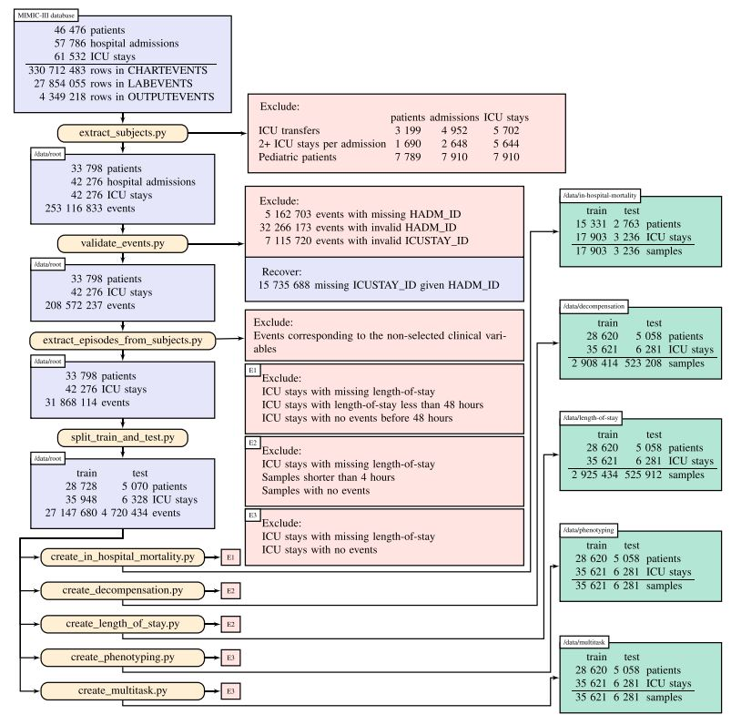

# Benchmark building pipeline

The data preparation pipeline is adapted from [Harutyunyan et al.'s article](https://www.nature.com/articles/s41597-019-0103-9) following
their schematics as shown in the Figure below (taken from their manuscript). The basic MIMIC cohort is built directly
with the pre-existing code. An adapted version has also been developed that allows the LSTM model
to also make use demographic feature variables. For the new STARR cohort, the same in/exclusion criteria have been used
after the variables have been located in the different tables of the STARR2019_DE database. Analysis
tools have been also added to inspect the data missingness and cohort demographics.

